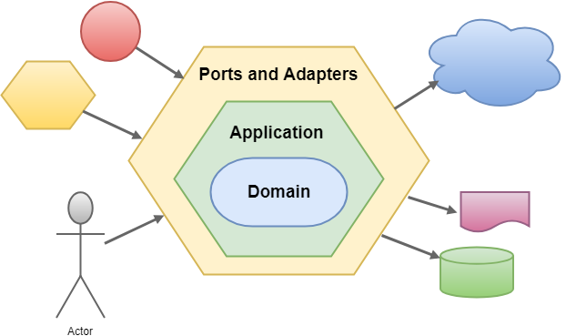
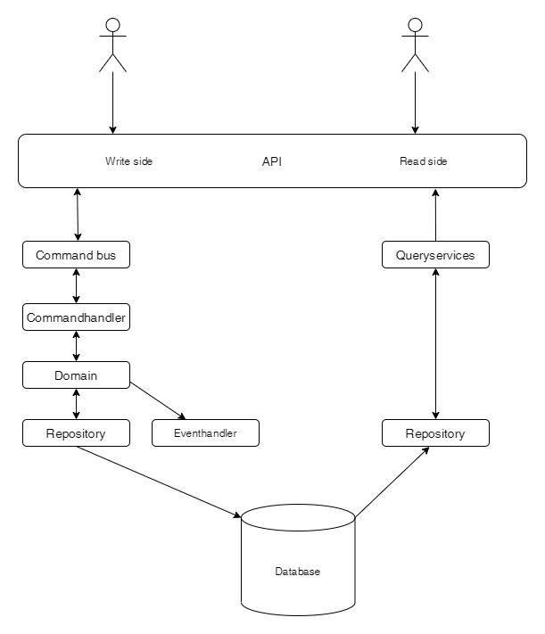

# Introduction 
This is a Tactical DDD project in Dotnet. It shows the audience how to 
- Implement a domain using CQRS
- Implement a hexagonal architecture 
- Structure a domain and domain services
- Giv examples of commands, events, aggregates and value objects by implementing a small domain (User)
- Meet the non functional requirements regarding observability (logging and Monitoring)
- Set the bar accordingly regarding tests, both how many and what types

# Architecture 
## Hexagonal Architecture
 

The hexagonal architecture is a way to split technology specific code from domain code, the domain related code is located in the **Domain** project and the technology specific code is in the **Integration.Repository** projects.

For example message bus specific code would be placed in **Integration.Messagebus**, if that is relevant in the future.

## CQRS
 

CQRS is an application architecture, that seperates the read side of the application to the write side. 

# Running the application
There is a few prerequisites that needs to be in place before you can run the application
- Dotnet core 3.1
- Have an MSSQL database running, that supports integrated security 
	- Make sure to have TCP/IP enabled in the SQL server Configuration manager
- Have Docker running on your machine for automated testing

## Security
When testing the application through Swagger, you can acquire an accesstoken from eg. Google.

In automated system tests, running in pipeline we do not validate lifetime, so we can do with a hard coded token.

Before interacting with the API, be sure to either
- Change the needed read and write scopes to match your AD groups (by changing the value of the ADGroup property in the **ReadPolicy** and **WritePolicy** classes)
- Acquire the AD group **XXX-XXX** (make something up that suits your identity provider) 

## Database
We use DbUp to handle automatic migration of the database. This runs at application startup.

To alter the database schema, you simply add a SQL script to **Integration.DBMigrations\scripts**, and make sure the script is idempotent.
